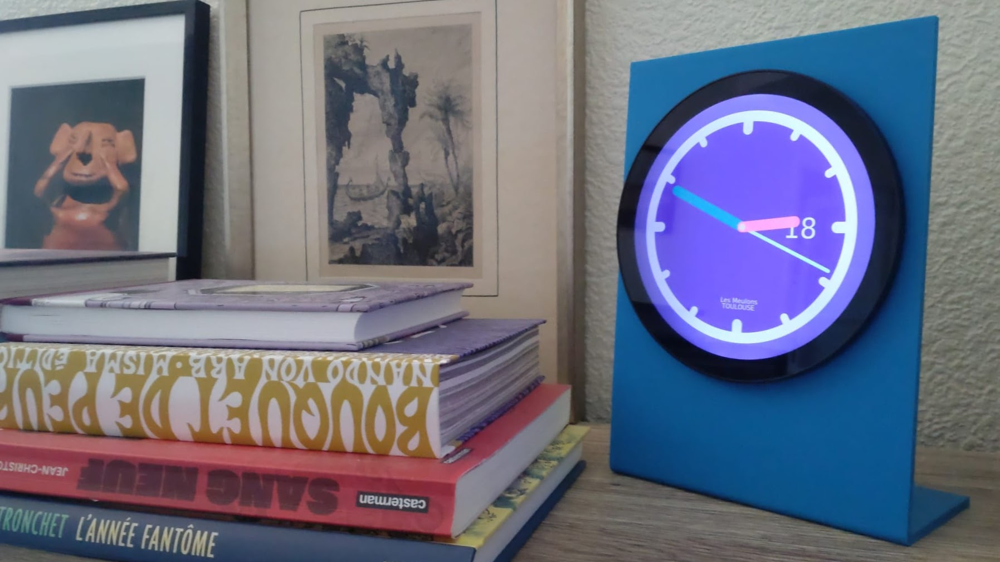

# Pendule

Simple analog clock build on top of a Raspberry Pi Zero and a
[Waveshare LCD
screen](https://www.waveshare.com/wiki/5inch_1080x1080_LCD).




Code started from the excellent [Gtkmm
documentation](https://gnome.pages.gitlab.gnome.org/gtkmm-documentation/sec-drawing-clock-example.html).

## Software build

```
$ sudo apt install -y libgtkmm-4.0-dev
$ cmake --fresh -B build -S .
$ cmake --build build
$ sudo cmake --build build -- install
```

## Operating system

The operating system is build using
[pi-gen](https://github.com/RPi-Distro/pi-gen) stage 2, based on
Debian Bookworm (💡 More on this to come soon). It is hosted on an SD
card, prepared using Raspberry Pi Imager with custom configuration
(WiFi, SSH, username, etc.).

```
matthias@pendule:~$ cat /etc/rpi-issue 
Raspberry Pi reference 2025-05-06
Generated using pi-gen, https://github.com/RPi-Distro/pi-gen, b9f63ee11b79aca73cde356babd2e1139a31c3c6, stage2
```

The machine broadcast its identity through mDNS. It acts as a NTP
server thanks to [chrony](https://chrony-project.org/). 

### Systemd units

Units are provided to start/stops HDMI display power at given time and
automatically start the `pendule` service.

## Assembly

A [3d model](./pendule-3d-model.FCStd) is provided. 

Wiring requires:
- Mini HDMI type C to HDMI type A
- USB type C to micro USB type B

A HaiMa Ds3231 RTC module is used to persist time when the system is
off.


