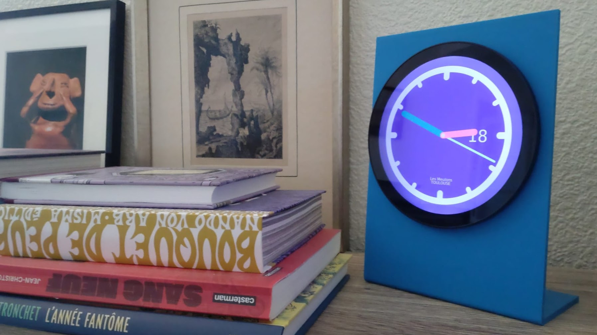

# Pendule

Simple analog clock build on top of a Raspberry Pi Zero and a
[Waveshare LCD
screen](https://www.waveshare.com/wiki/5inch_1080x1080_LCD).




Code started from the excellent [Gtkmm
documentation](https://gnome.pages.gitlab.gnome.org/gtkmm-documentation/sec-drawing-clock-example.html).

## Software build

``` bash
$ sudo apt install -y libgtkmm-4.0-dev
$ cmake --fresh -B build -S .
$ cmake --build build
$ sudo cmake --build build -- install
```

### DEB Packaging

A DEB package can be build with:
``` bash
$ cmake --fresh -B build -S . -DCMAKE_BUILD_TYPE=Relase --fresh
$ cmake --build build --target package
```

It installs systemd units to start/stops HDMI display power at given time and
automatically start the `pendule` service.

## Assembly

A [3d model](./pendule-3d-model.FCStd) is provided. 

Wiring requires:
- Mini HDMI type C to HDMI type A
- USB type C to micro USB type B

A HaiMa Ds3231 RTC module is used to persist time when the system is
off.
